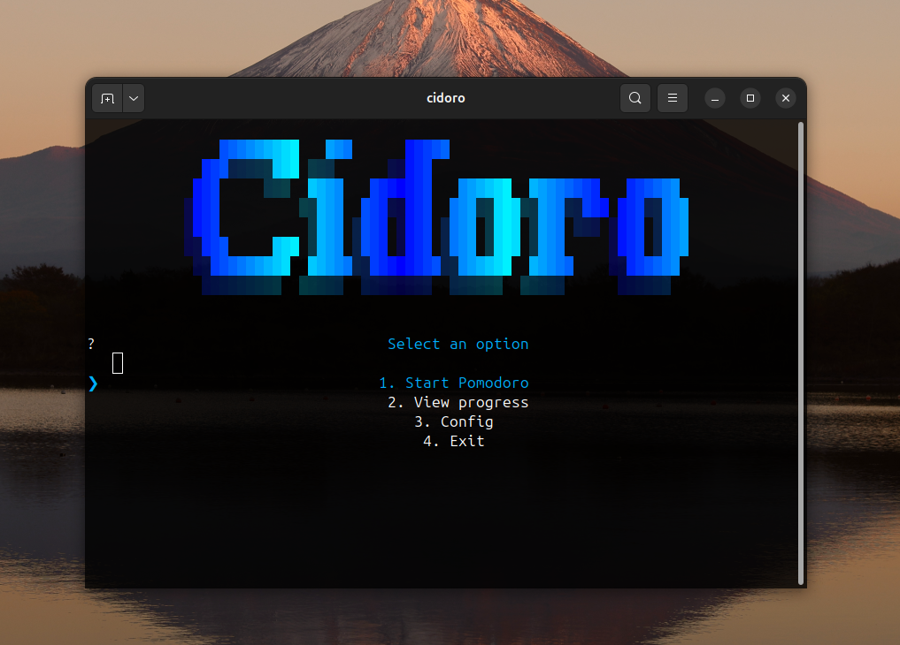

# 🍅 Cidoro

Minimalist CLI Pomodoro timer for focus, discipline and productivity.



---

## 🧭 Table of Contents

| Section | Description |
|--------|-------------|
| 📌 [About](#about) | Project overview and purpose |
| ⚙️ [Technologies](#technologies) | Main tools and libraries |
| 🧪 [Compatibility](#compatibility) | Tested platforms |
| 🚀 [Installation](#installation) | Quick setup guide |
| 🍅 [Usage](#usage) | How to use |
| 📁 [Project Structure](#project-structure) | Key files and folders |
| 📄 [License](#license) | Licensing info |
| 👤 [Author](#author) | Contact information |

---

## About

**Cidoro** is a lightweight Pomodoro timer built entirely for the command line.  
Perfect for developers, students, or anyone who wants a distraction-free workflow with features like customizable themes, sound notifications, and progress tracking.

---

## Technologies

- **Python 3** (≥3.7)
- [InquirerPy](https://github.com/kazhala/InquirerPy) – Interactive CLI menus
- [Pystyle](https://github.com/xdvrx1/pystyle) – Colorful terminal output
- **FFmpeg** (`ffplay`) – Sound playback
- **JSON** – Session storage

---

## Compatibility

Tested on:
- Ubuntu 22.04 LTS
- Debian-based distributions

Should run smoothly on most systems with Python 3 and `ffplay` installed.

---

## Installation
> [!NOTE]
> For the installation to work, you must have git installed previously.

Clone the repository:

```bash
git clone https://github.com/pTheDevoted/cidoro
cd cidoro
```

Make the installer executable and run:

```bash
chmod +x install.sh
./install.sh
```

This will:
- Set up a virtual environment (`cidoro_env`)
- Install dependencies
- Install Cidoro in editable mode (`pip install -e .`)
- Check and install `ffplay` if missing

---

## Usage

Activate the environment:

```bash
source cidoro_env/bin/activate
```

Start the application:

```bash
cidoro
```

Inside the CLI, you can:
- Start pomodoro sessions
- View past progress
- Change themes and settings

---

## Project Structure

```
cidoro/
 ├── cli.py           # CLI menus
 ├── utils.py         # Pomodoro logic
 ├── display.py       # Visuals and colors
 ├── alarm.mp3        # Alarm sound
 ├── themes.txt       # Saved theme (auto-generated)
 ├── progress.json    # Session history (auto-generated)
assets/
 └── logo.png         # Project logo
install.sh            # Installer script
pyproject.toml        # Build config
README.md
LICENSE
```

---

## License

Distributed under the MIT License.  
Feel free to use, modify, and share.

---

## Author

Pedro-A.
- Instagram: [@pedrodevoted](https://instagram.com/pedrodevoted)
- Discord: thedevoted

---
